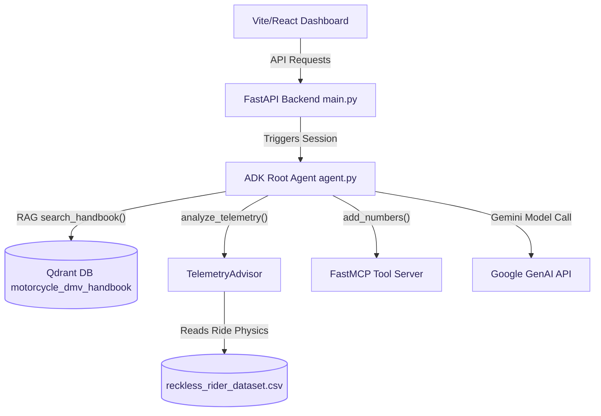
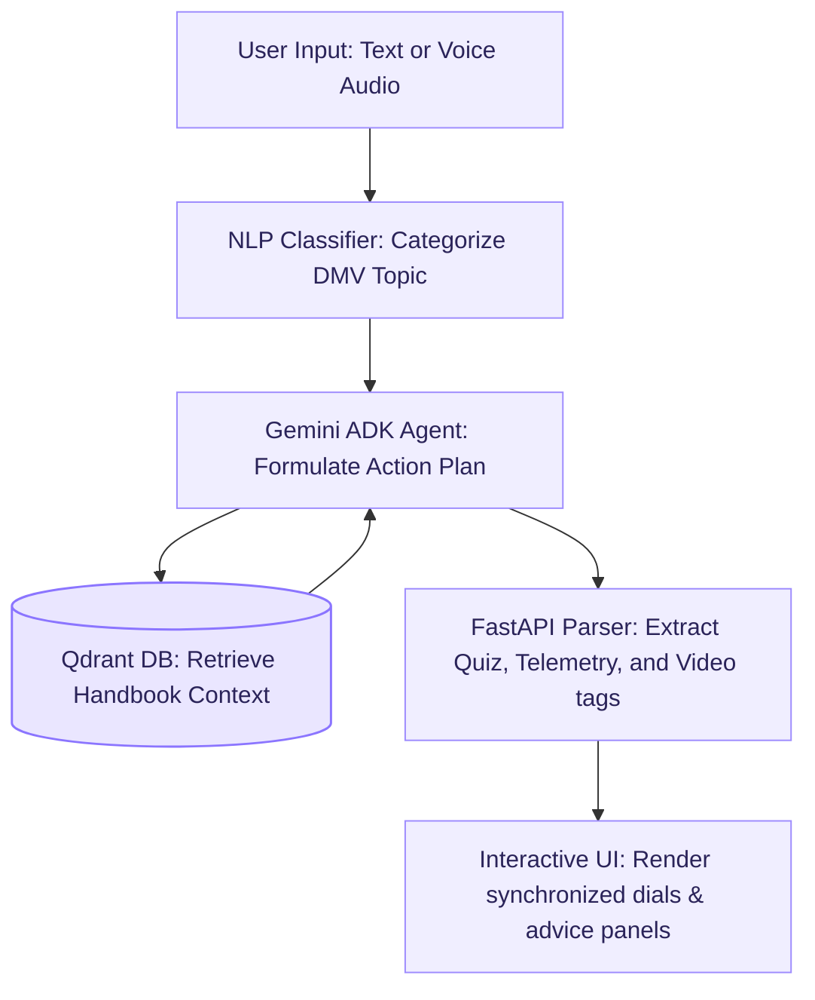
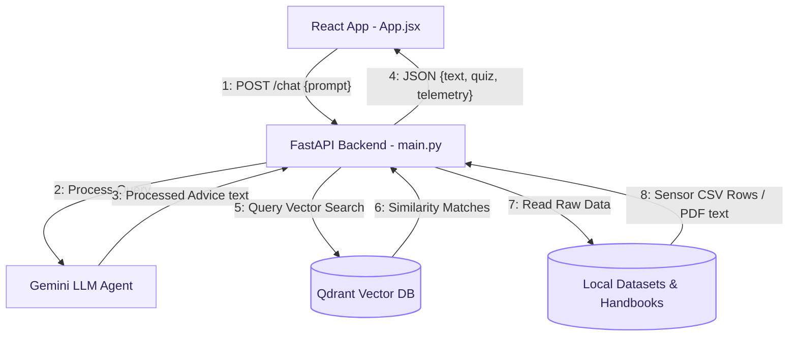
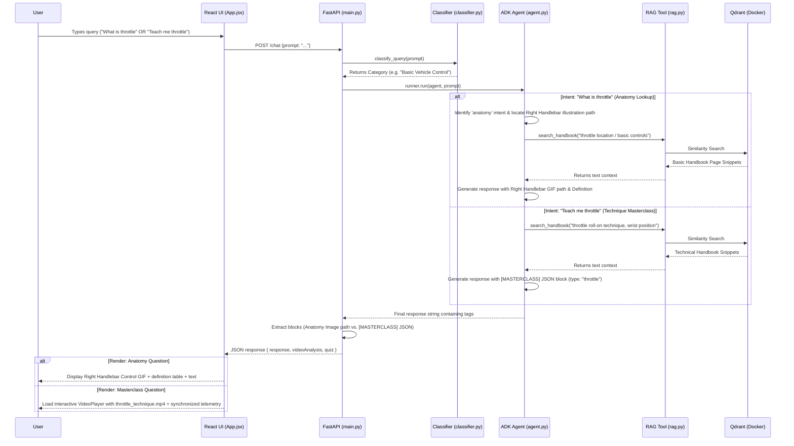
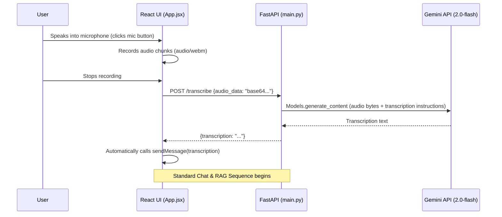
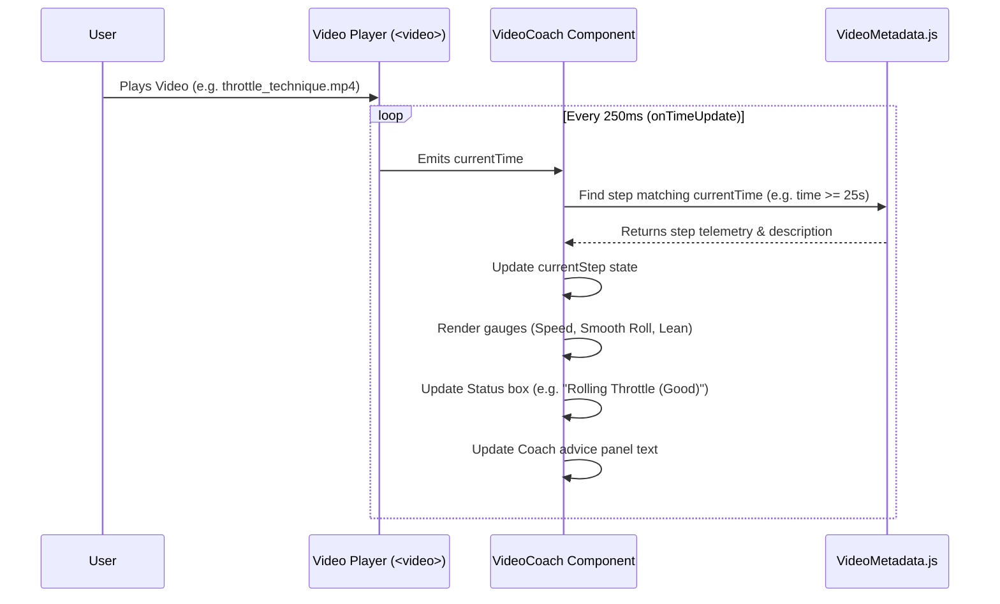
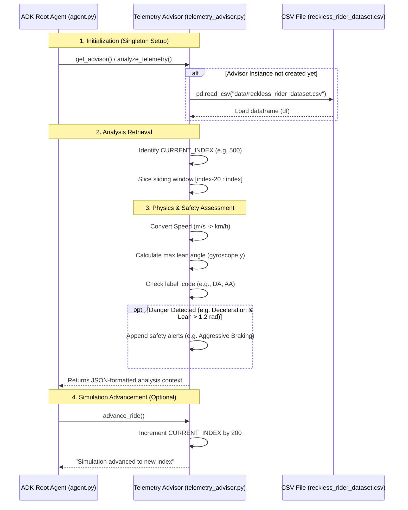

# MotorCycleCoach Architecture

This document describes the architecture, component hierarchy, and the operational flows of the MotorCycleCoach system.

## System Component Diagram

The following flowchart illustrates the system component architecture and the flow of query orchestration:

---

## Process Block Flow Diagram

The following block flow diagram outlines the pipeline steps a query traverses: from input ingestion, curriculum categorization, reasoning loops, retrieval-augmented database checks, FastAPI structural parsing, and final modular frontend rendering.

---

## Component Communication Diagram

The following communication diagram illustrates the network relations and numbered call sequences occurring between modules (like UI, API Gateway, Agent, and Storage clusters) to handle and fulfill client queries.

---

## Operational Workflows

### 1. Main Chat & RAG Flow (Text Query)

This flow illustrates how the system handles text queries, specifically highlighting how the agent evaluates user intent between basic identification/anatomy (e.g. *"What is throttle?"*) and hands-on skill learning (e.g. *"Teach me throttle technique"*):

### 2. Voice Input & Transcription Flow

This flow occurs when a user clicks the microphone button to record and ask a question via voice.

### 3. Video Player & Telemetry Synchronization Flow

This flow drives the interactive masterclass where the telemetry gauges and safety warnings change dynamically as the video plays.

### 4. Ride Telemetry Analysis Flow

This sequence flow describes the initialization, sliding-window calculations, safety anomaly checks, and simulated data advancement within the telemetry evaluation module:

---

## Component Breakdown

### 1. Frontend (`/frontend`)
- **App.jsx**: The main control board. It coordinates the chat stream, holds local state (chat history, user input, loading status), and handles media recording for the microphone utility.
- **VideoCoach.jsx**: Coordinates play/pause states of the video demonstration and matches the playback time against known milestones to update telemetry cards.
- **TelemetryViz.jsx**: A specialized visualization card that renders a history chart and gauges using historical rider physics.
- **Quiz.jsx**: Handles interactive question-answering, displaying correct/wrong feedback, explanation banners, and scoring metrics.
- **Sidebar.jsx**: Displays the CA DMV-aligned learning path, updates mastery trackers out of 50 questions, and flags problem areas requiring focus.
- **index.css**: Houses the custom styling, grid layout, glassmorphism design, and animations.

### 2. Backend API Orchestration (`backend/src/coachagent/main.py`)
- **FastAPI**: Declares routing endpoints, handles CORS, logs timing data, and enforces token-based HTTP Bearer authentication.
- **InMemoryRunner**: Maintains Gemini session/context states across client requests.
- **Block Parsers**: Regexp-free tokenizers that split the raw Gemini output into modular fields (`response`, `sources`, `quiz`, `telemetry`, `videoAnalysis`).

### 3. AI Agent Logic (`backend/src/coachagent/agent.py`)
- **Google ADK Agent**: Instantiates a specialized agent using the instructions listed in `backend/motorcycle_coach_prompt.txt`.
- **Tools**: Binds RAG search capabilities (`search_handbook`), telemetry assessment (`analyze_telemetry`), and simulation steps (`advance_ride`) to the model execution context.

### 4. Semantic Classifier (`backend/src/coachagent/classifier.py`)
- **Gemini Query Classifier**: Takes incoming queries and maps them to one of the 10 official CA DMV curriculum topics. Used to dynamically route and attribute quiz scores to progress buckets.

### 5. RAG Intelligence (`backend/src/coachagent/rag.py`)
- **Vector Store**: Connects to the Qdrant instance.
- **Search Logic**: Runs vector similarity search via `GoogleGenerativeAIEmbeddings` using `models/gemini-embedding-001`.

### 6. Ride Telemetry Advisor (`backend/src/coachagent/telemetry_advisor.py`)
- **Data Source**: Parses `data/reckless_rider_dataset.csv`.
- **Analysis**: Calculates lean angles and speeds, detects aggressive acceleration/deceleration thresholds, and generates JSON blocks detailing safety violations (e.g., mid-corner braking).

### 7. Vector Database (Qdrant)
- **Mode**: Run via Docker container exposing port `6333`.
- **Index**: Stores embedded CA DMV Motorcycle Handbook chunks.
