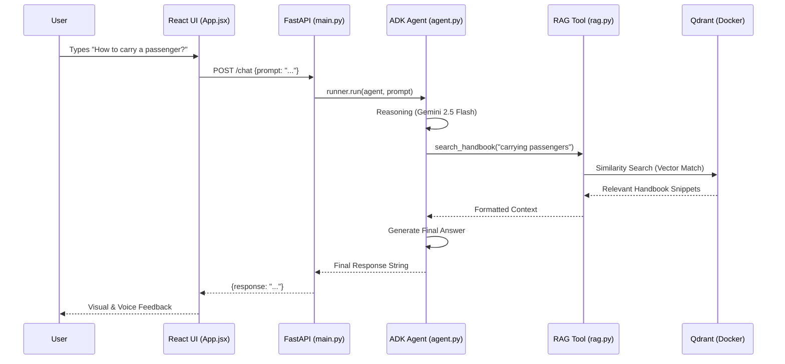

# MotorCycleCoach Architecture

This document describes the flow of a user query through the MotorCycleCoach system.

## System Workflow Diagram

## Component Breakdown

### 1. Frontend (`/frontend`)
- **App.jsx**: The main entry point. It manages state for the chat history and handles the transition between text and voice modes.
- **index.css**: Implements the premium "Dark Rider" aesthetic.
- **Vite Proxy**: Configured in `vite.config.js` to route API calls to the Python backend on port 8000.

### 2. Backend Orchestration (`backend/src/coachagent/main.py`)
- **FastAPI**: Acts as the bridge.
- **InMemoryRunner**: A Google ADK component that maintains the conversation logic.
- **Endpoints**:
    - `/chat`: Main text interaction.
    - `/transcribe`: Processes base64 audio and converts it to text using Gemini.

### 3. AI Agent Logic (`backend/src/coachagent/agent.py`)
- **Google ADK Agent**: Configured with a specialized persona and instructions.
- **Model**: Gemini 2.5 Flash.
- **Tools**: The agent is equipped with the `search_handbook` function, which it invokes automatically when it needs factual data from the DMV.

### 4. RAG Intelligence (`backend/src/coachagent/rag.py`)
- **Vector Store**: Connects to the Qdrant instance via `QdrantVectorStore`.
- **Search Logic**: perform a similarity search using `GoogleGenerativeAIEmbeddings` to find the most relevant chunks of the handbook.

### 5. Data Ingestion (`backend/ingestion.py`)
- **Goal**: One-time setup to populate the database.
- **Process**:
    1. Loads PDFs from `/data`.
    2. Splits them into semantic chunks using `RecursiveCharacterTextSplitter`.
    3. Generates embeddings for each chunk.
    4. Upserts them into the Docker-based Qdrant server.

### 6. Vector Database (Qdrant)
- **Mode**: Running in Docker on port `6333`.
- **Collection**: `motorcycle_dmv_handbook`.
- **Persistence**: Data is saved to the host at `./qdrant_storage`.
